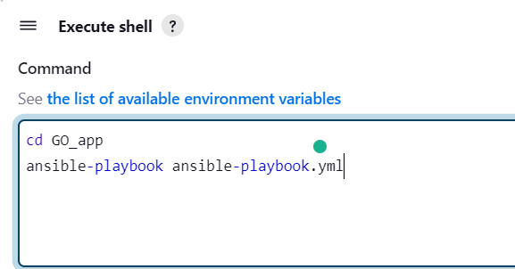

# Steps to Deploy Website on EC2 Instence using Jenkins
We will use ansible-playbook to deploy a website which is running into docker container.
## 1] Create && Configure EC2 instance
Step 1:
```bash
1. Create EC2 instence
2. Security Groups Rules:
    1. SSH
    2. HTTP: 80
    3. Custom rule: 8080 ----> for jenkins
    4. Custom rule:5000 -----> for website
3. Create Key_Pair and download it
```
Step 2:
Change `<file.pem>` permissions
```bash
sudo chmod 400 file.pem
```
Step 3:
Connect to the created EC2 instence:
```bash
sudo ssh -i file.pem ubuntu@PUBLIC_IPv4_DNS_NAME
```
Step 4:
Install jenkins
```bash
sudo apt update -y
sudo apt install openjdk-11-jdk -y
java -version
JAVA_HOME=/usr/lib/jvm/java-8-openjdk-amd64/jre/bin/java
echo $JAVA_HOME
export JAVA_HOME
sudo apt install wget 
wget -q -O - https://pkg.jenkins.io/debian-stable/jenkins.io.key
sudo sh -c 'echo deb https://pkg.jenkins.io/debian-stable binary/ > /etc/apt/sources.list.d/jenkins.list'
sudo apt update -y 
sudo apt-get install jenkins -y
```
Step 5:
Access Jenkins through browser:
In the browser's address bar, enter `http://EC2_Public_IPv4_address:8080` and press Enter.


Step 6:
Install Docker:
```bash
sudo apt-get update
sudo apt-get install \
    ca-certificates \
    curl \
    gnupg \
    lsb-release
curl -fsSL https://download.docker.com/linux/ubuntu/gpg | sudo gpg --dearmor -o /usr/share/keyrings/docker-archive-keyring.gpg
echo "deb [arch=$(dpkg --print-architecture) signed-by=/usr/share/keyrings/docker-archive-keyring.gpg] https://download.docker.com/linux/ubuntu \
  $(lsb_release -cs) stable" | sudo tee /etc/apt/sources.list.d/docker.list > /dev/null
sudo apt-get update
sudo apt-get install docker-ce docker-ce-cli containerd.io
```
Step 7:
Add `$USER` to docker group and change permission of `/var/run/docker.sock`
```bash
sudo usermod -aG docker $USER
sudo chmod 666 /var/run/docker.sock
```
Step 8:
Install Ansible
```bash
sudo apt update
sudo apt install ansible -y
```
## 2] Jobs in jenkins
1. Freestyle Job
Step 1:
```bash   
1. Add Repository [https://github.com/ZaynabMohammed/jenkins.git](https://github.com/ZaynabMohammed/jenkins.git), in Source Code Management
2. Add build setup then Execute Shell 
```


Step 2:
Check that website is running into docker container inside our EC2 instance
```bash
$docker ps
CONTAINER ID   IMAGE       COMMAND              CREATED         STATUS         PORTS                                               NAMES
6669f596d471   app_image   "httpd-foreground"   3 minutes ago   Up 3 minutes   80/tcp, 0.0.0.0:5000->8080/tcp, :::5000->8080/tcp   app
```
2. Pipeline Job
Step 1:
Run a pipeline Job with below script
```bash
pipeline {
    agent any
	
    stages {
	    stage('Git') {
            steps {
                git 'https://github.com/ZaynabMohammed/jenkins.git'
            }
        }
        stage('Run ansible playbook') {
            steps {
                script {
                    dir('EC2_jenkins') {
                        sh '''
                            ansible-playbook ansible-playbook.yml
                        '''
                    }
                }
            }
        }
    }
}
```
Step 2:
Check that website is running into docker container inside our EC2 instance
```bash
$ docker ps
CONTAINER ID   IMAGE       COMMAND              CREATED          STATUS          PORTS                                               NAMES
713742a921eb   app_image   "httpd-foreground"   18 seconds ago   Up 17 seconds   80/tcp, 0.0.0.0:5000->8080/tcp, :::5000->8080/tcp   app
```
