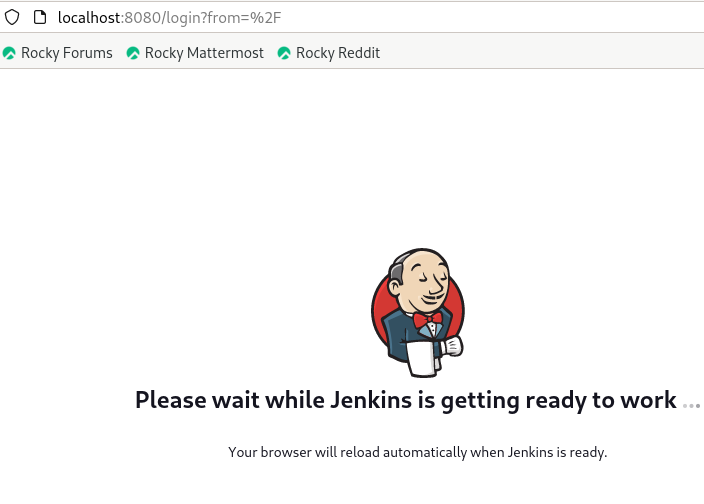

# Customize the official Jenkins Docker image to install docker into it
## Follow this link, to find all steps
[Customize the official Jenkins Image](https://www.jenkins.io/doc/book/installing/docker/)

 
 
## Running container based on custom image
```bash
$docker ps
CONTAINER ID   IMAGE                           COMMAND                  CREATED         STATUS         PORTS                                                                                      NAMES
a9ce44ab38d1   myjenkins-blueocean:2.452.3-1   "/usr/bin/tini -- /u…"   7 seconds ago   Up 7 seconds   0.0.0.0:8080->8080/tcp, :::8080->8080/tcp, 0.0.0.0:50000->50000/tcp, :::50000->50000/tcp   jenkins-blueocean
```
  

## What we will do inside jenkins Container ?!
   From this github repo [https://github.com/ZaynabMohammed/Multistage_docker.git](https://github.com/ZaynabMohammed/Multistage_docker.git), we will create a free_style job in jenkins to deploy GO_app.
   1.  Create a free_style job with name go_app
   2.  Add git repo
      
   
   
   4.  In Build steps feild, choose Execute shell
      
      
 
## GO_app now is running inside `jenkins-blueocean` container. 

```bash
$ docker exec -ti jenkins-blueocean bash
jenkins@a9ce44ab38d1:/$ docker ps
CONTAINER ID   IMAGE           COMMAND       CREATED         STATUS         PORTS                                       NAMES
c82f121a143e   multistage_go   "/app/main"   4 minutes ago   Up 3 minutes   0.0.0.0:8085->8080/tcp, :::8085->8080/tcp   app2
```
