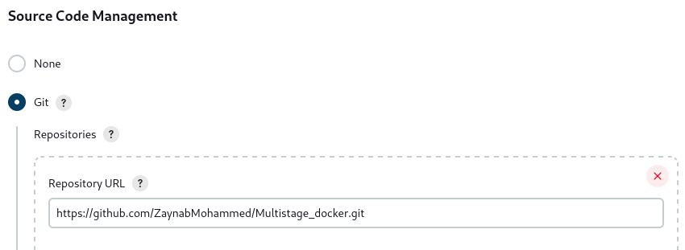
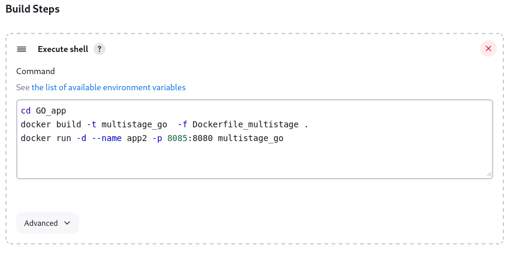

# Customize the official Jenkins Docker image to install docker into it
## Follow this link, to find all steps to Customize the official Jenkins image
[Customize the official Jenkins Image](https://www.jenkins.io/doc/book/installing/docker/)

 
 
## Running jenkins container based on custom image
 
```bash
$docker ps
CONTAINER ID   IMAGE                           COMMAND                  CREATED         STATUS         PORTS                                                                                      NAMES
a9ce44ab38d1   myjenkins-blueocean:2.452.3-1   "/usr/bin/tini -- /u…"   7 seconds ago   Up 7 seconds   0.0.0.0:8080->8080/tcp, :::8080->8080/tcp, 0.0.0.0:50000->50000/tcp, :::50000->50000/tcp   jenkins-blueocean
```
## To access Jenkins container
  In the browser's address bar, enter `http://localhost:8080` and press Enter.
  
  

## What we will do inside jenkins Container ?!
   From this github repo [https://github.com/ZaynabMohammed/Multistage_docker.git](https://github.com/ZaynabMohammed/Multistage_docker.git), we will create a job in jenkins to deploy GO_app.
  
   ### 1) Job with Freestyle project option:
   1.  Create a free_style job with name go_app
   2.  Add git repo
      
     
   
   3. In Build steps feild, choose Execute shell
      
      
   
   4. GO_app is running, now inside `jenkins-blueocean` container. 

  ```bash
   $ docker exec -ti jenkins-blueocean bash
   jenkins@a9ce44ab38d1:/$ docker ps
   CONTAINER ID   IMAGE           COMMAND       CREATED         STATUS         PORTS                                       NAMES
   c82f121a143e   multistage_go   "/app/main"   4 minutes ago   Up 3 minutes   0.0.0.0:8085->8080/tcp, :::8085->8080/tcp   app2
 ```
 ### 2) Job with Pipeline option:
 1. Run a Pipeline job with below script
```bash
pipeline {
    agent any
	
    stages {
	    stage('Git') {
            steps {
                git 'https://github.com/ZaynabMohammed/Multistage_docker.git'
            }
        }
        stage('Build and Run Docker') {
            steps {
                script {
                    dir('GO_app') {
                        sh '''
                            docker build -t multistage_go -f Dockerfile_multistage .
                            docker run -d --name app2 -p 8085:8080 multistage_go
                        '''
                    }
                }
            }
        }
    }
}
```
 2. GO_app is running, now inside `jenkins-blueocean` container. 
```bash
$ docker exec -ti jenkins-blueocean bash
jenkins@8b02dead366f:/$ docker ps
CONTAINER ID   IMAGE           COMMAND       CREATED         STATUS         PORTS                                       NAMES
0479786f152d   multistage_go   "/app/main"   3 minutes ago   Up 3 minutes   0.0.0.0:8085->8080/tcp, :::8085->8080/tcp   app2
```

 
